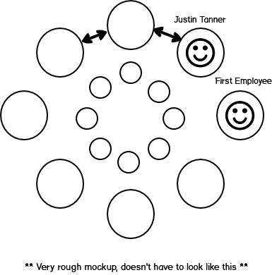
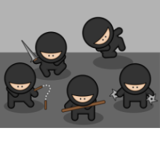

### 150N is a distributed software company based in Estonia founded by a [Canadian](https://typora.io/#windows).

### What are you currently building?

Currently we are building a website for antique collectors to replace this [website](https://tuckdbpostcards.org).

### How we work
We work as a distributed team.

* We work online, from home, from a coffee shop, there is no office

- We work at whatever time of day works best ( there are deadlines )
- We work [asynchronously](2) to avoid interrupting each other ( sometimes we have meetings )
- We communicate by writing ( only resorting to instant messages or voice chat when needed )
- We only work with people with whom we can collaborate for life ( that's the the lofty goal )

### Why Estonia?

In [2014](https://en.wikipedia.org/wiki/E-Residency_of_Estonia) Estonia launched it's [eResidency program](https://e-resident.gov.ee/). Allowing any non-Estonian to easily start a software company. In addition the accounting firm [Xolo](https://www.xolo.io/) makes managing a company a breeze.

### What does 150N stand for?

150 is a reference to [Dunbar's number](https://en.wikipedia.org/wiki/Dunbar%27s_number), the maximum number of humans that can co-operate without the need for too much hierarchy.

The "N" could mean many things: Noodles in a bowl, Ninjas in a dojo, Nuts in a shell.

### Want to work with us?

Email [work@150n.ee](mailto:://work@150n.ee)

### Inspired by

1. [Matt Mullenweg](https://distributed.blog/)
2. [37 Signals](https://basecamp.com/books/remote)
3. [Naval Ravikant](https://twitter.com/naval)

